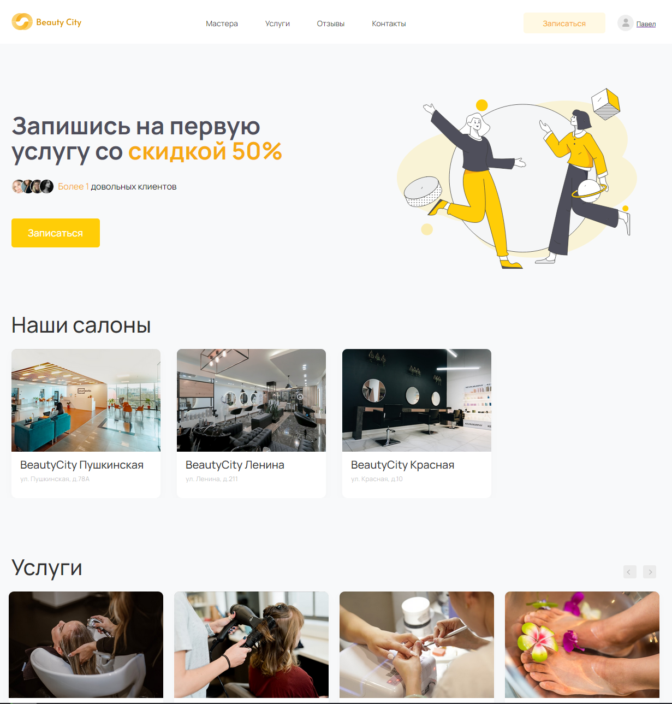

# Сайт сервис BeautyCity

Сеть BeautyCity объединяет несколько салонов красоты, действующих под единой франшизой.

<details>
  <summary>Скриншот главной страницы</summary>
  <div align=center>
    
  </div>
</details>

## Установка

1. Скачайте код с репозитория.
2. Установите Python [3.10.12](https://www.python.org/downloads/release/python-31012/)
3. Создайте виртуальное окружение (если нужно) и установите все необходимые зависимости с помощью `pip` или `pip3`
    ```shell
    pip install -r requirements.txt
    ```
4. Создайте файл `.env`  в корне проекта
    ```env
    SECRET_KEY = <секретный_ключ_проекта>
    DEBUG = <включение/отключение отладочного режима>
    ALLOWED_HOSTS = <список разрешённых хостов>
    ```
5. Примените миграции
    ```shell
    python3 manage.py migrate
    ```
6. Создайте суперпользователя для доступа к админ-панели Django
    ```shell
    python3 manage.py createsuperuser
    ```

## Запуск

1. Заполните базу данных или используйте нашу [тестовую](example/db.sqlite3).
2. Запустите веб-сервер:
    ```sh
    python3 manage.py runserver 0:8000
    ```

***

Код написан в образовательных целях на онлайн-курсе для веб-разработчиков [Devman](dvmn.org).
